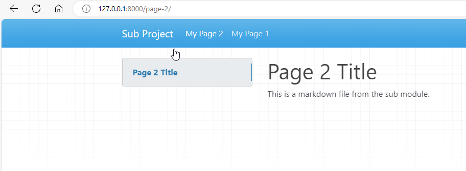
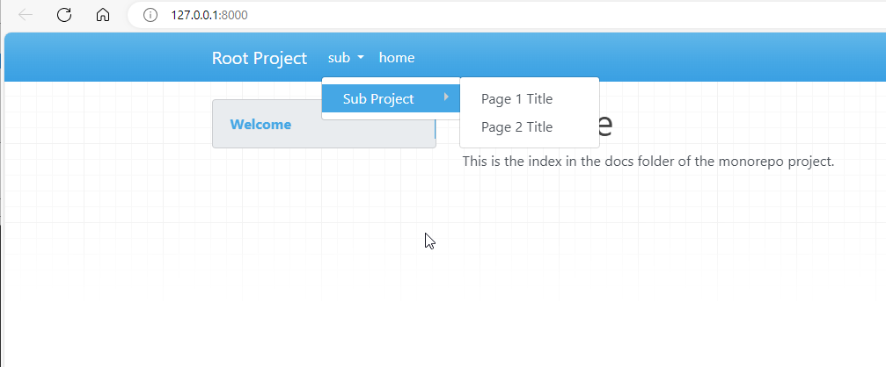

# awesome-pages-monorepo

Demo of awesome-pages in combination with the monorepo plugin.

## Installation

The example comes with scripts. They are on Windows, but are trivial to run on other environments.

1. clone the repo
2. in the root of the repo, run `scripts/1_create_venv.ps1` to create a virtual environment
3. if you are in VSC, you might need to re-open the terminal or make sure that the virtual environment is activated
4. run `scripts/2_update_pip.ps1` to upgrade pip
5. run `scripts/3_pip.ps1` to install the requirements
6. run `scripts/4_mkdocs_serve_sub.ps1` or `scripts/5_mkdocs_serve_root.ps1`

## Case 1: serve the sub

In the sub folder, run `mkdocs serve`.

This is working perfectly:

The `.pages` file is picked upl

## Case 2: serve the root

In the root folder, run `mkdocs serve`.

Monorepo works and includes the sub project. But the .pages is not picked up.

